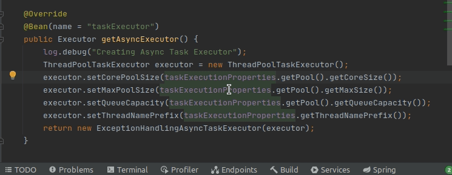

+++
author = "Isaac Aiman"
title = "Multicursores en IntelliJ"
date = "2021-04-14"
description = "Introducción al uso de multicursores en IntelliJ"
categories = [
    "Tech",
    "IntelliJ"
]
tags = [
    "intellij",
]
image = "liam-briese-wB7V7mhufy4-unsplash.jpg"

+++

En ocasiones resulta de gran utilidad poder editar múltiples partes de un fichero a la vez. Para las tareas más sencillas normalmente basta con hacer uso de las utilidades de refactor que nos proporciona IntelliJ, pero no siempre nos pueden ofrecer la solución que buscamos. Es por ello que IntelliJ implementó en 2014 los famosos multicursores que ya exisitían en otros editores de texto como Sublime Text. 

## Selección múltiple con teclado

### Seleccionar todas las ocurrencias
Atajo de teclado: `Alt` + `Ctrl` + `Shift` + `J`

### Selecionar la siguiente ocurrencia
Atajo de teclado: `Alt` + `J`

### Eliminar la ocurrencia
Atajo de teclado: `Alt` + `Shift` + `J`

## Selección múltiple con ratón

### Selección en bloque
Seleccionamos un bloque de texto mientras mantenemos pulsado `Alt` + `Ctrl` + `Shift`. Esto nos creará tanttos selectores como líneas hayamos seleccionado.

### Selección libre
Podemos pulsar con el ratón en cualquier parte mientras mantenemos pulsado `Alt` + `Shift`  y se creará un selector en ese punto.

![(seleccion-libre.gif)